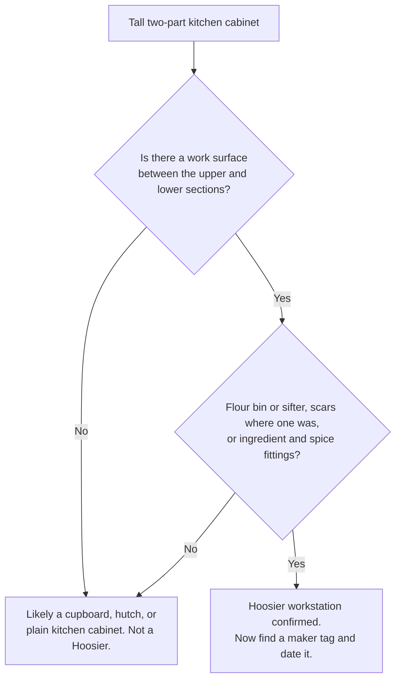

# Chapter Draft: The Hoosier Cabinet

> Built from the real `form_hoosier_cabinet` source, in the updated pattern: no icons, the
> two-stage hook, depth by merit (Hoosier is a marquee, high-gift-appeal form, so it earns a
> fuller treatment), value as guidance not numbers, a comparison table, a decision tree, and a
> callback to the period-or-reproduction tree to satisfy the rule-of-three. Illustration needs
> are listed at the end for you to make. Visuals are marked `[VISUAL: ...]`.

`[CATEGORY: CASE AND STORAGE]`

# The Hoosier Cabinet
*also called: Hoosier, Hoosier cupboard, baker's cabinet, kitchen workstation, Sellers cabinet, McDougall cabinet, Napanee cabinet*

`[ERA BAND: 1840 ░░░░░ 1890 ███████ 1930s ███▒ 1940. Heyday roughly 1900 to the 1930s.]`

`[HERO PLATE: your own Hoosier, three-quarter view, doors and work surface visible. Wide canvas, generous margin.]`

## Rule it out in 10

Look for a **work surface between an upper and a lower section**, and any sign of a **flour bin or ingredient fittings**.

A Hoosier is not just a tall kitchen cupboard. It is a freestanding **workstation**. If the piece is only shelves and doors, with no pull-out or built-in work top and no kitchen-workflow fittings, it is a cupboard, a hutch, or a plain kitchen cabinet. Move on.

If it has a work surface plus a flour bin, a sifter, spice racks, or the scars where those once lived, you are on the short list. Keep going.

## What it is

The Hoosier cabinet is the original all-in-one kitchen. Before built-in cabinetry, a family bought one freestanding piece that combined storage, food preparation, and a work surface into a single step-saving station. The name comes from Indiana, the home of the Hoosier Manufacturing Company and many competitors, but the form spread nationwide and was widely imitated. Its strongest years run from about 1900 into the 1930s, fading as built-in kitchens took over before and after the Second World War.

You can recognize the workflow built into it. A lower section with deep storage and drawers. A work surface in the middle, often a pull-out, frequently topped in enamel, porcelain, or zinc for a sanitary, wipe-clean prep area. An upper section organized for ingredients, with spice jar racks, small drawers, shelves, and often a tambour (roll-front) door that hides them. The signature feature is the **flour bin with a built-in sifter**, mounted in the upper section so the cook could measure and sift in one motion. Accessory hardware can include a sugar bin, a bread drawer, a pull-out recipe-card holder, labeled glass jars, and ant-proof casters.

## On the short list, confirm it

Look for several of these, not just one:

- A flour bin or sifter, or clear scars and mounting holes where one was removed.
- A pull-out or fixed work surface, especially an enamel or porcelain top.
- Spice jar racks, small ingredient drawers, or a tambour door in the upper section.
- Accessory fittings: sugar bin, bread drawer, recipe holder, original labeled jars.
- A maker tag, metal plaque, decal, or branded hardware.

The more of the workstation system that survives, the more confident the call, and the more the piece is worth.

## Real Hoosier, or just a cupboard?

## Date it

The Hoosier rewards a few specific tells:

- **Material and finish.** Earlier examples, roughly 1890 to 1915, often have **oak** cases with heavier, furniture-like construction. Later examples, roughly 1915 into the 1930s, are frequently **painted or enamel-finished** in coordinated kitchen colors. Depression-era and later refinishing can blur this, so read it alongside the hardware.
- **Hardware and patents.** Maker plaques, patented sifter and door hardware, and the flour-bin design are strong dating anchors. Patent dates stamped in metal give you a firm "not before" point.
- **Construction.** Machine-made case construction throughout is normal and expected here. This is factory furniture, so do not treat machine work as a strike against it the way you would on an early Windsor.
- **Casters and tops.** Ant-proof casters and original enamel tops are period-appropriate and add value when original.

A note on reproductions: nostalgic Hoosier-style cabinets have been made from about 1970 onward. Tell them by modern fasteners, plywood, modern drawer slides, decorative distressing, and replica hardware. The same logic you learned earlier applies here. When in doubt, run the **period-or-reproduction decision tree** from the Method section. Modern slides, plywood, and Phillips screws point to a later piece. (You will see that tree again because it works on almost everything, which is exactly the point.)

## Do not confuse it with

| Form | What it really is | The tell that separates it |
|---|---|---|
| **Hoosier cabinet** | Freestanding kitchen **workstation** | Work surface plus flour or ingredient fittings |
| Freestanding kitchen cabinet | Broader kitchen **storage** | Storage only, no workstation system |
| Hutch | Dining display and storage | Display and dining, no work surface or flour bin |
| Step-back cupboard | Cupboard geometry, storage | Storage only, no kitchen workflow fittings |
| Pie safe | Cools and stores baked goods | Ventilated or pierced tin panels |
| Jelly or jam cupboard | Stores preserved food | Storage of preserves, not active prep |

## What hurts the value

- **Stripped and incomplete cabinets sold as complete.** A missing flour bin, work top, jars, or upper doors lowers both confidence and price. Look for the scars and ask what is gone.
- **Reproduction jars and replica hardware** presented as original.
- **Married pieces**, where an upper from one cabinet meets a lower from another. Check that wood, wear, finish, and hardware agree top to bottom.
- **Outright modern reproductions** sold as period.

## What it is worth, in plain terms

This is a gift-market and kitchen-nostalgia favorite, so a good one sells itself. The value lives in **completeness and originality**. A complete cabinet, with its original flour bin and sifter, original enamel work top, original hardware, and a maker label, sits firmly in the **premium and very desirable** range. A stripped or incomplete cabinet, or one wearing reproduction parts, is **common and modest**. The condition of the enamel top and the survival of the flour system move the needle more than anything else.

## Quick field routine

First, confirm the form. A work surface between upper and lower sections, plus a flour or ingredient system. If those are missing, it is not a Hoosier.

Second, inventory what survives. Flour bin, sifter, work top, jars, tambour, accessory drawers. Completeness is value.

Third, find the maker. A tag, plaque, decal, or patented hardware.

Fourth, date and authenticate. Oak and heavier early, painted and enamel later, and watch for the reproduction tells.

---
---

## Illustration list for this chapter (for owner to make)
| ID | Shows | View or angle | Purpose | Format |
|---|---|---|---|---|
| HOO-1 | Full Hoosier cabinet, doors closed | Three-quarter, full height, wide margin | Hero plate | Owner photo |
| HOO-2 | Upper section open, flour bin and sifter visible | Front, close | Show the signature feature | Owner photo |
| HOO-3 | Pull-out enamel work surface extended | Three-quarter | Show the workstation function | Owner photo |
| HOO-4 | Tambour or roll door, spice rack behind | Front, close | Confirm upper fittings | Owner photo |
| HOO-5 | Maker tag, plaque, or patent-stamped hardware | Macro | Dating and attribution | Owner photo, or CC0 link if available |
| HOO-6 | Ant-proof caster | Macro | Period hardware detail | Owner photo or Claude SVG line diagram |
| HOO-7 | Labeled "anatomy" diagram of a Hoosier (callouts: flour bin, sifter, work top, tambour, sugar bin, bread drawer) | Schematic front | Teaching overview | Claude SVG line diagram |
| HOO-8 | "Real Hoosier or just a cupboard" decision tree | n/a | Teaching | Claude Mermaid (drafted above) |
