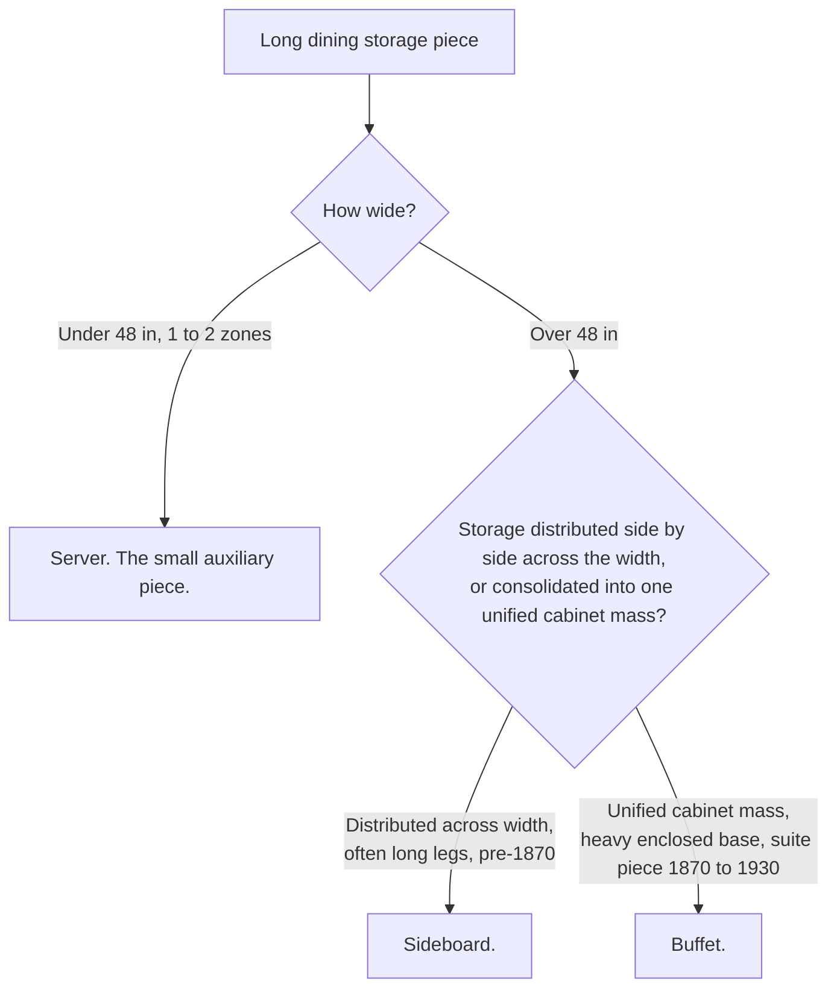

# Chapter Draft: The Sideboard

> From the real `form_sideboard` source. The hard part here is telling a sideboard from a buffet
> and a server, so this chapter carries a decision tree, reinforcing the visual-tool approach.

`[CATEGORY: CASE AND STORAGE]`

# The Sideboard
*also called: buffet (casual or retail), hunt board (Southern, taller examples)*

`[ERA BAND: 1840 ██████████ 1900 ▒░ 1940. The form runs from about 1780, through Federal and Empire and into the Victorian dining room.]`

`[HERO PLATE: your own sideboard, three-quarter, full width. Wide canvas, generous margin.]`

## Rule it out in 10

A sideboard is a **long, low dining-room case**, wider than it is tall, with **storage spread across its width** in several side-by-side zones, and a **broad serving top**.

If it is a tall two-part piece with a display top, that is a hutch. If it is a small auxiliary piece with one or two drawers, that is a server. The sideboard is the long anchor along the dining-room wall.

## What it is

The sideboard is the oldest and broadest of the dining-storage forms, made continuously from about 1780. Its signature is **distributed storage across the width**: banks of drawers for linen and silver beside cabinets for dishes and bottles, sometimes with cellarettes or bottle drawers, arranged side by side so the piece reads horizontally. The top is a real serving surface for platters and decanters. It appears across Federal, Hepplewhite, Sheraton, and Empire, and continues through Victorian production.

## On the short list: sideboard, buffet, or server?

This is the call people get wrong, so run it deliberately.

In words: measure the width, read whether the storage spreads across the width or consolidates into one block, and read the base. Long legs and distributed zones, especially before 1870, say sideboard. A heavy enclosed cabinet mass in a matched suite, with a mirror or plate rail, c. 1870 to 1930, leans buffet. Suite matching is supporting evidence only, confirm the structure first.

## Date it

- **Style and base.** Federal and Hepplewhite and Sheraton and Empire styling, on long tapered or turned legs, point earlier (roughly 1780 to 1850). Heavy enclosed oak cabinet bases in dining suites point to the buffet era, 1870 to 1930.
- **Construction.** Read joinery, nails, and saw marks as always (Method section). Hand-cut dovetails and cut nails point earlier; uniform machine work points to factory Victorian and later.

## Do not confuse it with

| Form | What it really is | The tell that separates it |
|---|---|---|
| **Sideboard** | Long dining case, storage across width | Distributed zones, broad serving top |
| Buffet | Unified cabinet-mass dining storage | One consolidated block, suite piece, 1870 to 1930 |
| Server | Small auxiliary serving piece | Under 48 inches, 1 to 2 drawers, light |
| Hutch | Two-zone display and storage | Tall, base plus a display superstructure |

## What hurts the value

- **A married top or replaced legs**, common on long case pieces. Check agreement all around.
- **Replaced hardware** and refinishing on a fine early example.

## What it is worth, in plain terms

A genuine **Federal or Hepplewhite sideboard** with good lines, original surface, and inlay sits firmly **premium**. An oak Victorian or early-twentieth-century buffet-style piece is **common and modest**, useful and very saleable. Age, original surface, and quality of line set the range.

## Quick field routine
First, confirm the form. Long, low, dining-room, distributed storage, serving top.
Second, run the sideboard-buffet-server call by width, storage organization, and base.
Third, date by style, base, and construction together.
Fourth, check for marriage and replaced legs.

---
## Illustration list for this chapter
| ID | Shows | View | Purpose | Format |
|---|---|---|---|---|
| SIDE-1 | Sideboard, full width | Three-quarter | Hero | Owner photo |
| SIDE-2 | Distributed storage zones across the width | Front | Defining feature | Owner photo |
| SIDE-3 | Sideboard vs buffet vs server | n/a | Teaching | Claude diagram (Mermaid, drafted above) |
| SIDE-4 | Base: long legs vs heavy enclosed cabinet | Side by side | Dating and form call | Owner photos or Claude SVG |
| SIDE-5 | Cellarette or bottle drawer | Close | Period detail | Owner photo |
