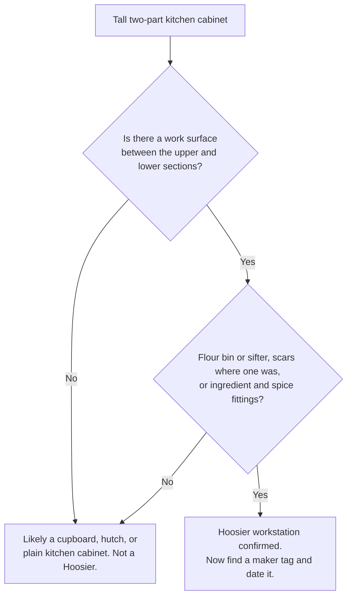

# Decision Tree: Real Hoosier, or Just a Cupboard?

> Renders as a flowchart when viewed on GitHub. From the Hoosier Cabinet chapter.

```mermaid
flowchart TD
  A["Tall two-part kitchen cabinet"] --> B{"Is there a work surface<br/>between the upper and lower sections?"}
  B -- "No" --> X["Likely a cupboard, hutch, or<br/>plain kitchen cabinet. Not a Hoosier."]
  B -- "Yes" --> C{"Flour bin or sifter, scars where one was,<br/>or ingredient and spice fittings?"}
  C -- "No" --> X
  C -- "Yes" --> D["Hoosier workstation confirmed.<br/>Now find a maker tag and date it."]
```
