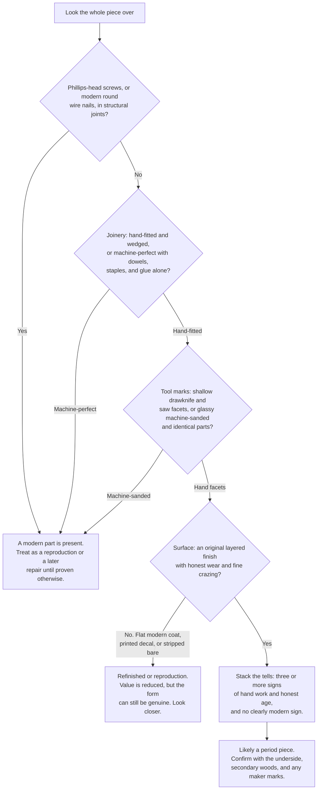

# Sample Teaching Diagram: Period or Reproduction?

> A sample, to judge the kind of teaching diagram Claude can build directly. This one is a
> decision tree the reader can run on almost any piece. It is written in Mermaid, which
> **renders as an actual flowchart when you view this file on GitHub** (and exports to clean
> vector art for the printed book). It is fully editable, so you keep it, tweak it, or swap it.
>
> If you like this, it becomes a recurring feature: the same "stack the tells" logic, returning
> in different chapters as a tree, a table, and a callback. That is the rule-of-three at work.

## Notes on format
- **Mermaid** (above) is best for decision trees and flowcharts. Renders on GitHub now, exports to vector art for print.
- **Tables and matrices**: plain Markdown or HTML, clean and simple.
- **Construction line diagrams** (a hand-cut versus machine dovetail, the three nail types, a wedged socket joint): I hand-build these as **SVG** vector art. Schematic and clear, not fine shaded illustration. Editable, keep or swap.
- Photoreal art is the one thing I cannot make. That is where your own photos carry the load.
