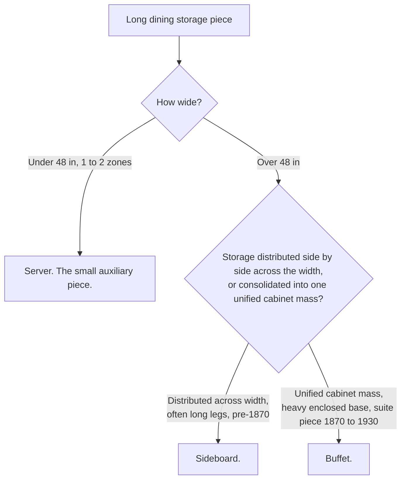

# Decision Tree: Sideboard, Buffet, or Server?

> Renders as a flowchart when viewed on GitHub. From the Sideboard chapter.

```mermaid
flowchart TD
  A["Long dining storage piece"] --> B{"How wide?"}
  B -- "Under 48 in, 1 to 2 zones" --> S["Server. The small auxiliary piece."]
  B -- "Over 48 in" --> C{"Storage distributed side by side across the width,<br/>or consolidated into one unified cabinet mass?"}
  C -- "Distributed across width,<br/>often long legs, pre-1870" --> D["Sideboard."]
  C -- "Unified cabinet mass,<br/>heavy enclosed base, suite piece 1870 to 1930" --> E["Buffet."]
```
