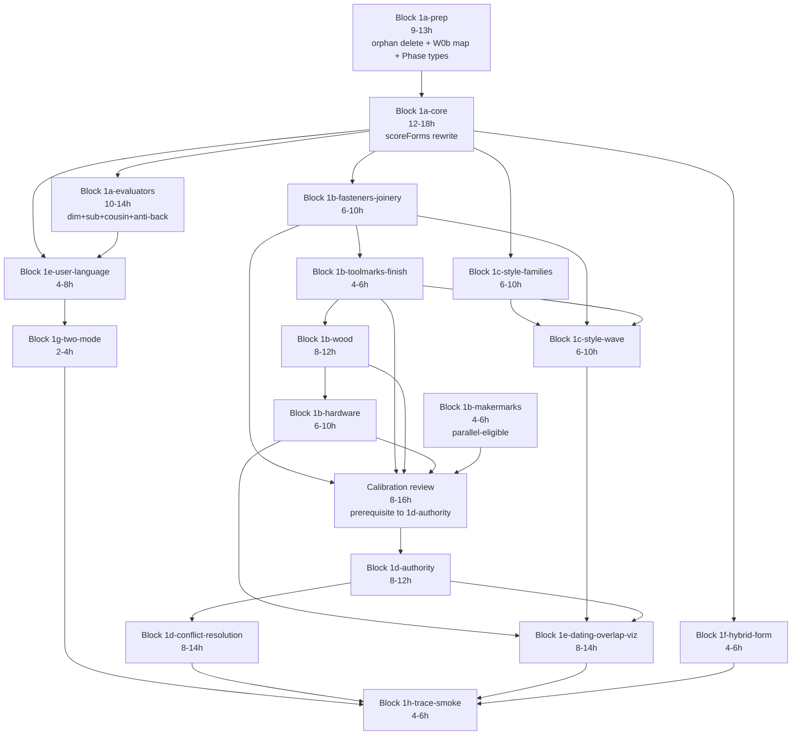

# Phase 3 Complete Sub-Block Decomposition

**Status:** Authored 2026-05-16. Reference document for Block 1 series execution authorizations.
**Authored against:** main HEAD `4c6f3ac` (Block 0.55 diagnostic infrastructure latest merge).
**Pacing assumption:** 45 hr/wk sustained.
**Supersedes** for sub-block-level planning: synthesis Section 12.1's flat 14-component list. The synthesis remains authoritative for project identity, working principles, canonical content state, and engine architecture target (Section 7.B).

---

## 0. Reframes since 2026-05-11 synthesis

Two material changes since synthesis authoring that affect this decomposition:

### 0.1 HCL no longer exists as a separate library

Synthesis Section 7.B and 12.1 treat `historicalClueLibrary.ts` as a future library that engine integration depends on. The Path A series (Blocks 0.5a / 0.5c / 0.5b / 0.5d, shipped 2026-05-12 through 2026-05-16) instead migrated all HCL content directly into the appropriate canonical libraries: toolmarks.ts (new), finish.ts (new), joinery.ts (extensions), fasteners.ts (extensions), woodEvidence.ts (extensions). `lib/evidence.ts` (the HCL prototype) and `lib/weighting.ts` (the CWT prototype) were deleted.

Net effect on this decomposition: "HCL integration" (synthesis 12.1) re-frames to "canonical evidence-library integration" across the now-populated libraries. The work item is the same shape (engine reads evidence libraries to derive period/dating signal); the integration target is more libraries but each one is more localized in scope.

### 0.2 styleFamilies.ts is content-complete

Synthesis treats `styleFamilies.ts` as a future library. Blocks 41-42 (Session 9) populated it with 26 style families and 108 STYLE_REVIVAL_WAVES entries. Phase 3 work on style attribution (synthesis 7.B.3) and the post-synthesis style-wave evidence layer (Section 1.G below) consumes an already-built library, not one to be authored.

### 0.3 Per-entry authority weights need consumption, not authoring

Synthesis Section 7.A.5 + 9.5 + 9.6 + 12.4 anchor "weighting integration" as a Phase 3 decision point with calibration review prerequisite. Path A series populated Frame-R3 dual fields (`replacement_likelihood`, `original_persistence`) on selected fastener/substrate entries, plus per-entry `positive_authority` / `hard_negative_authority` across all canonical libraries. The bridge-vs-inline-rewrite decision (synthesis 7.B.4) still stands; with `weighting.ts` deleted, the bridge-revival option is foreclosed. The remaining decision is purely how engine reads the per-entry weights (inline P4 rewrite to consume canonical entries directly).

---

## 1. Phase 3 component inventory

Grouped by category. Each row: name + scope + canonical content consumed + engine touch-points + output + dependencies. Synthesis reference cited where explicit; "post-synthesis addition" otherwise.

### Category A — Engine reasoning rewrites (replace flat-form clue-keyed logic)

| # | Component | Synth ref | Consumes | Engine touch-points | Output | Depends on |
|---|---|---|---|---|---|---|
| A1 | scoreForms taxonomic rewrite | 7.B.1, 12.1#1 | forms.ts (id, family_id, spatial_behavior_id), families.ts, spatialBehaviors.ts, constructionLogic.ts | engine.ts:1685-2172 (scoreForms); engine.ts:3665-3692 (PE.p3); engine.ts:3658-3663 (PE.p2 caller) | Returns canonical FormEntry IDs (not free-text labels) with weights + support + alternatives | A0 (namespace alignment) |
| A2 | dateFromEvidence rewrite | 7.B.1, 7.B.5 | forms.ts anti_classification_guidance.boundary_date; AntiClassificationGuidance interface; per-library period_associations | engine.ts:2259-2961 (dateFromEvidence); engine.ts:3658-3663 (PE.p2 caller) | Returns `{ date_floor: number, date_ceiling: number, confidence_band, support, limitations }` — structured numerics replacing free-text "c. 1830-1870" strings | A1 |
| A3 | P5 conflict resolution rewrite | 7.B.5, 12.1#4 | AntiClassificationGuidance (boundary_date, boundary_type, guidance_text, pre/post_boundary_classifications); per-entry authority weights | engine.ts:3869-3942 (PE.p5); special-case Chesterfield/vinyl + hard-negative override blocks | Data-driven conflict resolution with appraiser-voice narrative from canonical entries (not canned engine prose) | A2, D1 |

### Category B — Evaluator additions (consume specific FormEntry / domain-entry fields)

| # | Component | Synth ref | Consumes | Engine touch-points | Output | Depends on |
|---|---|---|---|---|---|---|
| B1 | Dimensional validator | 7.B.1, 7.C#2, 12.3#2 | FormEntry.dimensional_thresholds; FormSubtype.dimensional_thresholds; SpatialBehaviorEntry dimensional defaults | New evaluator function called from scoreForms; downstream of A1 | Per-candidate confidence delta from dimensional consistency check | A1 |
| B2 | Subtype evaluator | 7.B.1, 7.C#3, 12.1#5 | FormEntry.subtypes[] (FormSubtype.distinguishing_attributes, dimensional_thresholds, date_floor, date_ceiling) | New evaluator function called from scoreForms after top form locked | Subtype assignment with confidence (may remain at parent level) | A1, B1 |
| B3 | Cousin contrast evaluator | 7.B.1, 7.C#4, 12.1#2, 12.2 | FormEntry.cousin_form_contrasts (currently free-form narrative) | New evaluator function in scoreForms disambiguation step | Per-candidate weight adjustment from contrast statement matches | A1; decision D-PH3-2 (structured representation?) |
| B4 | Anti-back-classification checker | 7.B.1, 7.C#5, 12.1#4 | FormEntry.anti_classification_guidance (14 forms × boundary_date) | New evaluator function in scoreForms guard step | Candidates failing boundary check re-route to pre/post_boundary_classifications targets | A1, A2 |
| B5 | Hybrid form router | 7.B.1, 7.C#9, 12.1#6 | FormEntry.secondary_form_associations (currently 1 form populated) | New evaluator at end of scoreForms; supplements primary form ID with hybrid annotation | Primary form ID + secondary association | A1; decision D-PH3-3 (subtype-level secondary associations?) |

### Category C — Library integrations (engine consumes canonical evidence libraries)

| # | Component | Synth ref | Consumes | Engine touch-points | Output | Depends on |
|---|---|---|---|---|---|---|
| C1 | Joinery + fasteners evidence integration | 7.B.1, 7.B.4; reframed from synth 12.1#10 (composite patterns) | joinery.ts (44 types + categories), fasteners.ts (types + subcategories + Frame-R3 fields) | engine.ts:3694-3868 (PE.p4 weighting); CLUE_LIBRARY (engine.ts:68-326) keys → canonical IDs | P4 reads canonical entry meta directly; eliminates inline CLUE_LIBRARY for joinery/fastener keys | A0 (namespace alignment) |
| C2 | Toolmarks + finish evidence integration | 7.B.1, reframed from synth 12.1#8 (HCL) | toolmarks.ts (6 types), finish.ts (8 types incl shellac/poly/refinished) | engine.ts:3694-3868 (PE.p4); engine.ts:2259-2961 (dateFromEvidence date-band signals) | P4 + dateFromEvidence read canonical entries; CLUE_LIBRARY entries for these domains deleted | A0 |
| C3 | Wood evidence integration | 7.B.2, 7.C#6, 12.1#7 | woodIdentification.ts (4 categories + species + substrates + cut/grain phenomena), woodEvidence.ts (substrate evidence, species evidence, cut-grain evidence, diagnostic signals, reasoning rules) | New evaluator wired into P3 (species/substrate identification) and P4 (period signal aggregation) | Wood-derived candidate forms + date signals + diagnostic-signal hits | A1; decision D-PH3-4 (WOOD_EVIDENCE_REASONING_RULES routing via migration_target) |
| C4 | Hardware evidence integration | 7.C#9, 12.1#10 | hardware.ts (types + categories + dual-assessment routing per D-FA33-5) | New evaluator wired into P3 and P4 | Hardware-derived candidates + period signals; assessment_layer ("frame" vs "upholstery") drives valuation gating | A1; decision D-PH3-5 (hardware library split?) |
| C5 | Maker marks integration (legacy → canonical) | 7.C#7, 12.1#9 | makerMarks.ts MAKER_ENTRIES (new canonical) replacing MAKER_MARKS (legacy) | engine.ts:2 (only constraints import); engine.ts:3282-3306 (matchMakerMarks); engine.ts:2346-2377 (dateFromEvidence maker-mark short-circuit) | matchMakerMarks consumes canonical MAKER_ENTRIES; legacy MAKER_MARKS deleted | (independent — can ship parallel to A series) |

### Category D — Reporting and rendering work

| # | Component | Synth ref | Consumes | Engine touch-points | Output | Depends on |
|---|---|---|---|---|---|---|
| D1 | Authority weight integration | 7.B.4, 7.A.5, 9.5, 9.6, 12.1#12, 12.4 | per-entry positive_authority + hard_negative_authority across all canonical libraries | engine.ts:3698-3714 (inline AUTHORITY_RANK); engine.ts:3716-3735 (REPLACEMENT_RISK); engine.ts:3737-3761 (DATE_HINTS) — all three inline tables deleted | P4 reads canonical entry weights directly; inline tables removed | C1+C2+C3+C4+C5; pre-integration calibration review (synth 9.6) |
| D2 | User-facing language rendering | 7.B.1, 7.C#10, 12.1#13 | FormEntry.common_aliases (174/183 populated); equivalent fields on other libraries | engine.ts:3664-3692 (PE.p3 display_form); engine.ts:2963-... (valueBand); P6 report assembly | Reports render "Identified as buffet (also commonly called sideboard)" with appraiser-voice narrative | A1 |
| D3 | Dating-overlap visualization | post-synthesis addition | Per-layer date signals from form, joinery, fastener, wood, finish, toolmark, style-wave, hardware evaluators | engine.ts:3944-4003 (PE.p6 report assembly); new visualization helper in P6 | Full Analysis report includes layered timeline visualization showing per-layer date envelopes + convergence points | C1, C2, C3, C4, D1, G1; decision D-PH3-6 (viz design) |
| D4 | Two-mode implementation refinement | 7.B.6, 12.1 (implicit) | Same canonical libraries — mode-specific configuration only | engine.ts:4008-4096 (runAllPhases) — mode flag routing | Field Scan vs Full Analysis as configuration variants of a single pipeline (synthesis intent already largely implemented) | A1, D2 |

### Category E — Schema and data work surfaced by Phase 3

| # | Component | Synth ref | Scope | Trigger |
|---|---|---|---|---|
| E1 | Cousin contrast structured representation | 7.C#4, 12.2, 12.4 | If cousin_form_contrasts free-form narrative proves insufficient for mechanical evaluation in B3, migrate all 175 populated entries to structured representation. | Surfaces during B3 implementation; decision D-PH3-2 |
| E2 | Subtype-level secondary_form_associations | 9.1, 12.2, 12.4 | If hybrid form authoring or B5 implementation surfaces need for subtype-level rather than form-level secondary associations, extend FormSubtype interface. | Surfaces during B5; currently 1-form population (mule chest) below 3+ threshold |
| E3 | AntiClassificationGuidance boundary_type expansion | 9.1, 12.4 | If wood domain authoring (C3) produces boundary semantics beyond form_emergence/form_extinction, expand boundary_type union. | Surfaces during C3 if new boundary semantics needed |
| E4 | Phase types tightened (`any` → structured interfaces) | post-inspection risk | PE phase functions are `any`-typed at boundaries; tightening prevents silent shape drift during A2/A3 rewrites. ~2h prep. | A series prerequisite (recommended 1a-prep scope) |
| E5 | scoreForms memoization | post-inspection risk | scoreForms invoked twice in runAllPhases (P2:3659, P3:3666) with no memoization; ~1h to add. | A1 cleanup |

### Category F — Orphan disposition work

| # | Component | Synth ref | Scope | Recommended timing |
|---|---|---|---|---|
| F1 | lib/intake.tsx (423 lines) | 7.A.1, 7.A.4, 9.5 | Zero importers; carries duplicate function definitions of components later moved into app/page.tsx. | Block 1a-prep (per inspection recommendation) |
| F2 | lib/styles.ts (420 lines) | 7.A.4, 9.5 | Zero exports/importers. Dead module. | Block 1a-prep |
| F3 | lib/constants.ts (245 lines) | 7.A.4, 7.A.5, 9.5 | Zero importers; carries 3rd-tier WM.tiers weight system never consumed. | Block 1a-prep |
| F4 | lib/fieldScan.ts (45 lines) | 7.A.4, 9.5 | Thin wrapper, not imported; Field Scan mode flows through PE.runAllPhases. | Block 1a-prep (or D4 if mode refinement reaches it first) |

### Category G — Post-synthesis additions

| # | Component | Synth ref | Consumes | Engine touch-points | Output | Depends on |
|---|---|---|---|---|---|---|
| G1 | Style-wave evidence layer | post-synthesis addition | styleFamilies.ts STYLE_REVIVAL_WAVES (108 entries), style_wave_associations + regional_patterns on canonical entries | New evaluator after style attribution; aggregates low-confidence style evidence across libraries | "This piece exhibits style-wave clues consistent with X wave, c. YYYY-ZZZZ" framed as supporting evidence, not authoritative style attribution | C1+C2+C3+C4 (need evidence-library integration first to surface style_wave_associations) |
| G2 | Dating-overlap visualization | post-synthesis addition (same as D3) | (see D3 row) | (see D3) | (see D3) | (see D3) |

### Cross-category: A0 (W0b namespace alignment)

Not in synthesis as a distinct component because synthesis predates the engine-vs-canonical key-namespace mismatch finding (CC inspection 2026-05-16). 86 CLUE_LIBRARY engine keys + ~50 hardcoded form-string literals in scoreForms + ~17 `*_pattern` keys from detectStructuralPatterns need mapping to canonical entry IDs. Of the 86 engine keys: ~11 are 1:1 renames; ~4 need split into 3-4 canonical sub-types (knowledge recovery); ~1 NO_MATCH (thick_veneer — knowledge migrated to prose-only notes). Mechanical work; prerequisite for A1.

---

## 2. Sub-block decomposition

12 sub-blocks across 6 series. Each ships as a single PR per Path A discipline (synthesis 3.16). Effort ranges; total Phase 3 = 111-179 hours.

### Block 1a series — Identification pipeline rewrite (A1, A2 partial)

#### Block 1a-prep — Foundation cleanup + namespace alignment

**Components:** A0 (W0b namespace map authoring + canonical-ID lookup table), E4 (Phase types tightening), F1+F2+F3+F4 (4 orphan deletions).
**Pre-conditions:** Block 0.55 shipped (DONE — main `4c6f3ac`).
**Scope IN:** Author `lib/engineCanonicalMap.ts` (or equivalent) mapping 86 CLUE_LIBRARY keys + ~50 scoreForms form-strings + 17 detectStructuralPatterns `*_pattern` keys to canonical entry IDs (or NO_MATCH where genuine). Add Phase1Gate / EvidenceDigest / runtime types covering PE phase I/O. Delete 4 orphan lib/ files (1,133 lines).
**Scope OUT:** Engine consumes the map (deferred to 1a-core); evaluator additions (deferred to 1a-evaluators); evidence-library integrations (deferred to 1b series).
**Effort:** 9-13 hours.
**Decisions surfaced:** D-PH3-1 (knowledge-recovery splits — accept the 4 splits into 3-4 canonical entries each, or defer the granularity for now?).
**Close criteria:** Map file compiles + lib/ tsc clean post-orphan-delete + Phase types declared + scripts/trace.ts re-runs and emits identical output to baseline (regression anchor).
**Risks beyond synthesis 7.C:** Phase types tightening may surface latent shape-drift bugs requiring cascade fixes. Orphan deletes may surface a forgotten import (low likelihood given 0.55 inspection already verified zero importers).

#### Block 1a-core — scoreForms taxonomic rewrite

**Components:** A1, E5 (scoreForms memoization), partial A2 (form-substring short-circuits in dateFromEvidence rewritten to canonical-ID lookups).
**Pre-conditions:** Block 1a-prep shipped + decision D-PH3-1 locked.
**Scope IN:** Rewrite scoreForms (488 lines, engine.ts:1685-2172) to: (a) consume canonical IDs from 1a-prep map, (b) traverse forms.ts → families.ts → spatialBehaviors.ts → constructionLogic.ts bidirectionally, (c) emit `Array<{ form_id: string; display_name: string; score: number; support: string[] }>` where form_id is canonical (e.g., `form_slant_front_desk`). Update PE.p2 + PE.p3 callers. Add memoization so single digest doesn't re-score. Update dateFromEvidence's 2 form-substring short-circuits (lines 2402, 2413) to canonical-ID lookups.
**Scope OUT:** Evaluator additions B1-B5 (defer to 1a-evaluators); dateFromEvidence full rewrite (A2 completes in 1b-fasteners-joinery once date signals come from canonical libraries); anti_classification_guidance integration (defer to B4 in 1a-evaluators).
**Effort:** 12-18 hours.
**Decisions surfaced:** D-PH3-7 (output shape — preserve `form: string` field as `display_name` for backward-compat with P6/valueBand, or break and migrate all consumers in one block?).
**Close criteria:** scripts/trace.ts produces canonical form IDs + display names; valueBand still resolves via display_name substring; tsc clean; manual trace diff against baseline shows expected ID-vs-label difference (no other regressions).
**Risks beyond synthesis 7.C:** 5-function coordinated migration (scoreForms + dateFromEvidence + valueBand + p3.display_form + field_scan rendering) per CC inspection risk #1. Risk mitigated by D-PH3-7 backward-compat decision; without it the block grows to 20-25h.

#### Block 1a-evaluators — Dimensional + subtype + cousin + anti-back evaluators

**Components:** B1, B2, B3, B4.
**Pre-conditions:** Block 1a-core shipped.
**Scope IN:** 4 new evaluator functions, each consuming the specific FormEntry/FormSubtype field for its job. B3 (cousin contrast) starts with free-form narrative matching (string-similarity heuristic); if insufficient, surface E1 (cousin structured representation) as a follow-on block. B4 reads the 14 populated anti_classification_guidance entries and routes failing candidates to pre/post_boundary_classifications targets.
**Scope OUT:** B5 hybrid form router (defer to 1f); structured cousin contrast migration E1 (defer if B3 string matching adequate); anti_classification_guidance population expansion beyond current 14 entries (deferred to a separate canonical-authoring block).
**Effort:** 10-14 hours.
**Decisions surfaced:** D-PH3-2 (if B3 string matching is unreliable, lock E1 as Block 1a-cousin-migrate sub-block).
**Close criteria:** scripts/trace.ts shows subtype assignment on ≥3 test pieces + dimensional weight adjustments visible + cousin disambiguation visible on near-tied candidates + anti-back-classification re-routes correctly when boundary violated.
**Risks beyond synthesis 7.C:** B3 cousin contrast quality depends on narrative phrasing consistency across the 175 populated entries — may surface authoring inconsistencies that need cleanup before evaluator can be reliable.

**Series total: 31-45 hours.**

### Block 1b series — Evidence library integration (C1-C5, completes A2)

#### Block 1b-fasteners-joinery — Engine consumes joinery + fasteners

**Components:** C1, completes A2 (dateFromEvidence reads canonical period_associations).
**Pre-conditions:** Block 1a-core shipped.
**Scope IN:** P4 reads canonical entries directly for joinery + fastener keys (no longer via inline CLUE_LIBRARY for these domains). dateFromEvidence consumes period_associations + replacement_likelihood + original_persistence per Frame-R3. Delete the joinery/fastener CLUE_LIBRARY entries from engine.ts.
**Scope OUT:** Other libraries (separate sub-blocks); D1 authority weight integration (cross-cutting block); STAGE date-range string → numeric migration (defer to D1).
**Effort:** 6-10 hours.
**Decisions surfaced:** none new.
**Close criteria:** Engine produces same date envelopes via canonical reads as previously via inline tables on representative trace fixtures; lib/ tsc clean; CLUE_LIBRARY entries for these domains removed.
**Risks beyond synthesis 7.C:** Granularity drift per CC inspection — canonical splits `cut_nail` into hand-headed vs machine-headed; engine had one key with 100-year date range. Recovery of finer granularity is value-add but may shift dating outputs on existing test pieces; trace baseline must be re-captured.

#### Block 1b-toolmarks-finish — Engine consumes toolmarks + finish

**Components:** C2.
**Pre-conditions:** Block 1b-fasteners-joinery shipped.
**Scope IN:** Same shape as 1b-fasteners-joinery for toolmarks.ts (6 types) + finish.ts (8 types). Delete the toolmark/finish CLUE_LIBRARY entries.
**Scope OUT:** Style/wood/hardware (separate sub-blocks).
**Effort:** 4-6 hours.
**Close criteria:** Same as 1b-fasteners-joinery.

#### Block 1b-wood — Wood identification + evidence integration

**Components:** C3.
**Pre-conditions:** Block 1b-toolmarks-finish shipped.
**Scope IN:** Engine reads woodIdentification.ts (categories, species, substrates, cut/grain) for material classification in P0/P3. Engine reads woodEvidence.ts for period signals. WOOD_EVIDENCE_REASONING_RULES applied per `migration_target` field (rules tagged `weighting_file` route to P4; `engine_reasoning` route to P3; `report_layer` route to P6).
**Scope OUT:** WOOD_DIAGNOSTIC_SIGNALS as cross-cutting pattern evaluator (defer if scope balloons; minimum-viable just reads species/substrate/cut-grain per entry).
**Effort:** 8-12 hours.
**Decisions surfaced:** D-PH3-4 (migration_target routing — confirm 3-target taxonomy adequate, or expand?).
**Close criteria:** Trace piece with cedar primary + plywood secondary correctly produces "cedar interior consistent with blanket chest; plywood drawer bottom HARD NEGATIVE for pre-1920 claim" reasoning.

#### Block 1b-hardware — Hardware integration

**Components:** C4.
**Pre-conditions:** Block 1b-wood shipped.
**Scope IN:** Engine reads hardware.ts (types + categories) for hardware-derived candidates + period signals. assessment_layer routing per D-FA33-5 (frame vs upholstery context gates valuation reasoning differently).
**Scope OUT:** Decision D-PH3-5 may surface need for hardware library split into hardwareIdentification.ts + hardwareEvidence.ts (deferred to follow-on if surfaced).
**Effort:** 6-10 hours.
**Decisions surfaced:** D-PH3-5 (hardware library split — only triggers if current single-file design proves insufficient during integration).
**Close criteria:** Trace pieces correctly route porcelain caster vs concealed euro hinge vs eastlake brass pull through expected period bands.

#### Block 1b-makermarks — Legacy → canonical maker marks migration

**Components:** C5.
**Pre-conditions:** Independent — can ship parallel to other 1b sub-blocks (only constraint: ship before D1).
**Scope IN:** matchMakerMarks (engine.ts:3282-3306) consumes canonical MAKER_ENTRIES (current new-format). Delete legacy MAKER_MARKS array + MakerMarkEntry_Legacy type from makerMarks.ts. Update dateFromEvidence:2346-2377 maker-mark short-circuit to canonical shape.
**Scope OUT:** Maker marks library expansion (synthesis Section 10.2 — separate Phase 2 work; not Phase 3).
**Effort:** 4-6 hours.
**Decisions surfaced:** none new.
**Close criteria:** Roos label + Lane label trace pieces produce same date attribution via canonical entries as via legacy.

**Series total: 28-44 hours.**

### Block 1c series — Style attribution layer

#### Block 1c-style-families — Engine consumes styleFamilies.ts

**Components:** part of A1 follow-on; integrates styleFamilies.ts as style attribution evaluator.
**Pre-conditions:** Block 1a-core shipped.
**Scope IN:** New style-attribution evaluator wired into P3. Consumes styleFamilies.ts STYLE_FAMILIES (26 entries) for style identification. Output combines with form ID at P3: "dresser, exhibiting features consistent with Eastlake style window 1875-1895" (synthesis 7.B.3 example). Replaces engine.ts:3672-3683 inline style derivation.
**Scope OUT:** Style-wave evidence layer (G1 — separate sub-block).
**Effort:** 6-10 hours.
**Decisions surfaced:** D-PH3-8 (style attribution vs identification surface — is style a separate report section, or inline with form ID?).
**Close criteria:** Trace pieces with Eastlake / Federal / Chippendale-revival features produce style attribution distinct from form ID.

#### Block 1c-style-wave — Style-wave evidence aggregator (post-synthesis addition)

**Components:** G1.
**Pre-conditions:** Block 1c-style-families + at least 2 of Block 1b series shipped (need style_wave_associations on canonical evidence entries to aggregate).
**Scope IN:** Aggregator function reads style_wave_associations + regional_patterns across canonical evidence entries. Surfaces "this piece exhibits style-wave clues consistent with X wave, c. YYYY-ZZZZ" framed as supporting evidence, NOT as authoritative style attribution. Distinct from 1c-style-families: that's high-confidence; this is low-confidence aggregation.
**Scope OUT:** Schema additions to canonical entries for style_wave_associations if currently sparse (defer to a canonical-authoring block).
**Effort:** 6-10 hours.
**Decisions surfaced:** D-PH3-9 (style-wave confidence threshold — what's the floor below which we don't surface?).
**Close criteria:** Trace piece with mixed Eastlake + Aesthetic Movement features produces wave-level "consistent with Eastlake wave c. 1870-1890" alongside high-confidence form ID.

**Series total: 12-20 hours.**

### Block 1d series — Authority + conflict resolution

#### Block 1d-authority — Per-entry authority weights replace inline tables

**Components:** D1.
**Pre-conditions:** All Block 1b series shipped + pre-integration weighting calibration review (synth 9.6) completed. Reviewing all per-entry authority weights across forms, families, spatial behaviors, wood identification, wood evidence, hardware, joinery, fasteners, toolmarks, finish, maker marks, style families is the prerequisite — this is a separate authoring/review block before 1d-authority engine work begins.
**Scope IN:** P4 reads canonical entry positive_authority + hard_negative_authority + replacement_likelihood + original_persistence directly. Delete inline AUTHORITY_RANK (3698-3714), REPLACEMENT_RISK (3716-3735), DATE_HINTS (3737-3761) from engine.ts.
**Scope OUT:** Calibration review itself (separate prerequisite block).
**Effort:** 8-12 hours engine work; 8-16 hours calibration review.
**Decisions surfaced:** D-PH3-10 (calibration review findings — accept current weights, or apply reconciliation patch?).
**Close criteria:** P4 outputs match canonical-entry-derived weights on trace fixtures; inline tables removed; no behavior regression on representative pieces.

#### Block 1d-conflict-resolution — P5 rewrite

**Components:** A3.
**Pre-conditions:** Block 1d-authority shipped.
**Scope IN:** Rewrite PE.p5 (engine.ts:3869-3942) to consume AntiClassificationGuidance.guidance_text + pre/post_boundary_classifications + per-entry authority. Replace hand-coded Chesterfield/vinyl + hard-negative override blocks with data-driven logic. Surface conflicts in user-facing reports with appraiser-voice narrative from canonical entries.
**Scope OUT:** Conflict types beyond what canonical entries currently capture (defer schema extensions if needed).
**Effort:** 8-14 hours.
**Decisions surfaced:** D-PH3-11 (which special-case blocks — if any — survive as engine-internal logic vs migrate to canonical entries?).
**Close criteria:** Trace piece with plywood drawer bottom + claimed-Federal-period-style correctly surfaces "HARD NEGATIVE: plywood drawer bottom (post-1920) categorically excludes pre-1920 Federal claim" via canonical guidance_text, not canned engine prose.

**Series total: 16-26 hours (excluding calibration review).**

### Block 1e series — Reporting and rendering

#### Block 1e-user-language — common_aliases + appraiser-voice rendering

**Components:** D2.
**Pre-conditions:** Block 1a-evaluators shipped.
**Scope IN:** P3.display_form rendering reads canonical common_aliases (174/183 forms populated). Report renders "Identified as buffet (also commonly called sideboard)". valueBand substring matches replaced with canonical-ID lookups + display-language overrides.
**Scope OUT:** Equivalent fields on non-form libraries (hardware/wood) if needed (defer to follow-on).
**Effort:** 4-8 hours.
**Decisions surfaced:** none new (D-PH3-7 already covers display_form contract).
**Close criteria:** Trace pieces render with primary canonical name + alias parenthetical where alias differs.

#### Block 1e-dating-overlap-viz — Full Analysis dating-overlap visualization

**Components:** D3 (= G2).
**Pre-conditions:** All Block 1b series + Block 1c series + Block 1d series shipped (need per-layer date envelopes to visualize).
**Scope IN:** P6 report assembly produces structured per-layer date data (form / joinery / fastener / wood / finish / toolmark / style-wave / hardware = 8 layers). Visualization helper renders timeline with each layer as a row, convergence-point highlighting where layers agree, divergence visible where they don't. Color-choice intentionality required to prevent 8-layer overlap mud.
**Scope OUT:** Visualization rendering details handed to app/page.tsx React layer — engine produces structured data, page renders.
**Effort:** 8-14 hours (engine-side structured data: ~4h; React visualization: ~6h; design iteration: ~4h).
**Decisions surfaced:** D-PH3-6 (visualization design — timeline-band vs confidence-weighted saturation vs convergence-point highlighting; recommend timeline-band rows with convergence-highlight overlay).
**Close criteria:** Full Analysis report renders 8-layer timeline visualization; trace piece with strong inter-layer convergence reads visually crisp; trace piece with inter-layer divergence reads visually informative (not muddy).

**Series total: 12-22 hours.**

### Block 1f — Hybrid form router

**Components:** B5.
**Pre-conditions:** Block 1a-evaluators shipped.
**Scope IN:** Hybrid form evaluator reads FormEntry.secondary_form_associations (currently 1 populated: form_mule_chest → form_blanket_chest). Output annotates primary form ID with hybrid association.
**Scope OUT:** E2 subtype-level secondary_form_associations schema extension (defer unless authoring surfaces need).
**Effort:** 4-6 hours.
**Decisions surfaced:** D-PH3-3 (if E2 needed, schedule schema migration block).
**Close criteria:** Mule chest trace produces "primarily chest of drawers; secondary blanket chest association (lift-top component)".

### Block 1g — Two-mode implementation refinement

**Components:** D4.
**Pre-conditions:** Block 1e-user-language shipped.
**Scope IN:** Audit Field Scan vs Full Analysis code paths; consolidate into configuration-driven single-pipeline shape per synthesis 7.B.6. Delete redundant code paths if found.
**Scope OUT:** Major behavioral changes to either mode (separate scope).
**Effort:** 2-4 hours.
**Decisions surfaced:** none new.
**Close criteria:** Both modes produce reports via single pipeline path with mode-flag-driven verbosity differences only.

### Block 1h — End-to-end trace + smoke pass

**Components:** verification + regression catch-net.
**Pre-conditions:** All preceding Block 1 series complete.
**Scope IN:** Run scripts/trace.ts against 5+ representative pieces (Roos cedar chest, Lane cedar chest, Eastlake dresser, MCM molded plastic chair, plywood-drawer "Federal" reproduction). Verify outputs are: (a) using canonical IDs throughout, (b) producing date envelopes via canonical reads, (c) rendering common_aliases, (d) producing dating-overlap viz data, (e) routing conflicts via canonical guidance. Document any post-Phase-3 follow-on items in Phase 4 backlog.
**Scope OUT:** Bug fixing (depends on findings — separate blocks if material).
**Effort:** 4-6 hours.
**Close criteria:** All 5 trace pieces produce expected outputs; Phase 4 backlog updated.

---

## 3. Sequencing diagram



**Serial spine (critical path):** 1a-prep → 1a-core → 1b-fasteners-joinery → 1b-toolmarks-finish → 1b-wood → 1b-hardware → calibration review → 1d-authority → 1d-conflict-resolution → 1e-dating-overlap-viz → 1h-trace = ~78-115 hours.

**Parallel-eligible:**
- 1b-makermarks anywhere after 1a-core (independent of evidence library chain)
- 1c-style-families anywhere after 1a-core (independent of evidence library chain except for 1c-style-wave dependency)
- 1f-hybrid-form anywhere after 1a-core
- 1e-user-language anywhere after 1a-evaluators

**Demo-readiness gate:** Block 1e-dating-overlap-viz is the user-facing visible Phase 3 deliverable. Demo readiness requires all blocks up through 1e-dating-overlap-viz.

**Decision-clustering blocks (Mike judgment required before execution):**
- Block 1a-prep surfaces D-PH3-1 (knowledge-recovery splits)
- Block 1a-core surfaces D-PH3-7 (output shape backward-compat)
- Block 1b-wood surfaces D-PH3-4 (migration_target routing taxonomy)
- Block 1b-hardware surfaces D-PH3-5 (hardware library split)
- Block 1c-style-families surfaces D-PH3-8 (style attribution surface)
- Block 1c-style-wave surfaces D-PH3-9 (style-wave confidence threshold)
- Pre-1d-authority: calibration review surfaces D-PH3-10 (reconciliation patch?)
- Block 1d-conflict-resolution surfaces D-PH3-11 (special-case block disposition)
- Block 1e-dating-overlap-viz surfaces D-PH3-6 (viz design)

---

## 4. Calendar projection

### Total Phase 3 effort
Sum of all sub-block ranges: **111-179 hours** (excluding calibration review's 8-16h prerequisite; including: 119-195h).

### At 45 hr/wk sustained pacing
- Best case (111h): **2.5 calendar weeks** of focused work
- Realistic case (145h midpoint): **3.2 weeks**
- Pessimistic case (179h): **4.0 weeks**
- Including calibration review (8-16h): add ~0.3 weeks

### Launch projection
Assuming Block 1a-prep starts week of 2026-05-18:
- **Phase 3 completion (Block 1h ships):** best ~2026-06-05; realistic ~2026-06-12; pessimistic ~2026-06-26
- **Phase 4 (synthesis 13.1; 1-2 wks):** ends ~2026-06-19 best to ~2026-07-10 pessimistic
- **Phase 5 (1-2 wks initial structure; synthesis 13.2):** ends ~2026-07-03 best to ~2026-07-24 pessimistic
- **Phase 6 (1-2 wks; synthesis 13.3):** ends ~2026-07-17 best to ~2026-08-07 pessimistic

**Launch projections at 45 hr/wk:**
- Best case: **mid-July 2026**
- Realistic: **late-July to early-August 2026**
- Pessimistic: **mid-August 2026**

For comparison, synthesis Section 11.5 at 30 hr/wk projected mid-to-late September 2026. The 45 hr/wk pacing compresses by 6-8 weeks.

### Variables that could compress
- 1b series sub-blocks compressing because evidence-library content is more uniform than expected (3 of 5 are clearly mechanical)
- Calibration review concluding "accept current weights" with no reconciliation patch
- Field Scan vs Full Analysis turning out to be a no-op refinement (Block 1g collapses)
- 1c-style-wave decision D-PH3-9 driving an aggressive threshold that simplifies the aggregator

### Variables that could extend
- D-PH3-1 (knowledge-recovery splits) accepted → cut_nail/wire_nail/staple_fastener/hand_forged_nail authoring blocks land before 1b-fasteners-joinery
- D-PH3-2 cousin contrast structured representation surfaces → adds 6-10h migration block (E1)
- D-PH3-5 hardware library split surfaces → adds an authoring block (likely 6-10h) before 1b-hardware
- Calibration review surfaces material drift → adds reconciliation block (6-10h)
- D-PH3-6 viz design iteration runs long → 1e-dating-overlap-viz extends to 14-20h
- Trace fixtures (1h) surface a regression requiring backout + fix
- Health-related capacity variation per synthesis 2.4 / 11.7

---

## 5. Decision register

D-PH3-N IDs for Phase 3 decisions surfaced during this decomposition. Cite existing audit log decisions where they lock things.

| ID | Decision text | Sub-block(s) affected | Options | CC lean | Status |
|---|---|---|---|---|---|
| D-PH3-1 | Accept the 4 knowledge-recovery splits (cut_nail → hand-headed vs machine-headed; wire_nail → common/finish/box; staple_fastener → construction vs upholstery; hand_forged_nail → rosehead/L-head/T-head) at 1a-prep map authoring time, or defer the granularity and keep engine coarse? | 1a-prep, 1b-fasteners-joinery | (a) Accept splits — engine learns finer granularity from canonical entries (b) Defer — engine stays coarse, finer canonical detail unused | (a) Accept. The Frame-R3 work in Path A already populated the finer-grained entries; deferring loses the investment value. | OPEN |
| D-PH3-2 | If B3 cousin contrast string-matching evaluator proves unreliable, migrate 175 free-form cousin_form_contrasts to structured representation? | 1a-evaluators (surfaces); 1a-cousin-migrate (resulting) | (a) Wait and see — start with string match; only migrate if needed (b) Migrate proactively before 1a-evaluators | (a) Wait. The synthesis 9.1 explicitly tracks this as 3+ threshold pattern; let evaluator quality drive the call. | OPEN |
| D-PH3-3 | Extend FormSubtype interface with subtype-level secondary_form_associations? | 1f-hybrid-form (surfaces) | (a) Extend if hybrid forms surface beyond mule chest's 1-form population (b) Defer indefinitely below 3+ threshold | (a) Extend if surfaces; (b) acceptable to defer since current 1-form population is below 3+ threshold per synthesis 9.1. | OPEN |
| D-PH3-4 | WOOD_EVIDENCE_REASONING_RULES.migration_target taxonomy adequate as 3-target (weighting_file / engine_reasoning / report_layer)? | 1b-wood | (a) Accept 3-target taxonomy (b) Expand if wood evidence authoring surfaces routing not captured | (a) Accept; expansion only if explicit need surfaces during 1b-wood. | OPEN |
| D-PH3-5 | Split hardware.ts into hardwareIdentification.ts + hardwareEvidence.ts (synthesis 4.4 anticipates this)? | 1b-hardware | (a) Split proactively before 1b-hardware (b) Keep single-file unless integration surfaces split need | (b) Keep single-file unless surfaces. Hardware diagnostic richness suggested split but Path A series did NOT execute split; treat as deferred decision. | OPEN |
| D-PH3-6 | Dating-overlap visualization design? | 1e-dating-overlap-viz | (a) Timeline-band rows (8 rows, one per layer; date X-axis; convergence overlay) (b) Confidence-weighted saturation (single timeline; layer saturation visible) (c) Convergence-point highlighting only (minimal viz; just show where layers agree) | (a) Timeline-band rows with convergence-highlight overlay. 8-layer overlap problem solved by giving each layer its own row; convergence-highlight overlay makes the "agreement zone" visually crisp without mud. | OPEN |
| D-PH3-7 | scoreForms output shape: preserve `form: string` field as display_name for backward-compat, or break and migrate all consumers (P6/valueBand/field_scan rendering) in 1a-core? | 1a-core | (a) Preserve display_name field — 1a-core stays bounded (b) Break and migrate everything in one block | (a) Preserve. The 5-function coordinated migration risk per CC inspection drops 1a-core back into bounded scope. Migrate consumers in subsequent blocks (1e-user-language) once the new shape is proven. | OPEN |
| D-PH3-8 | Style attribution UI surface — separate report section, or inline with form ID? | 1c-style-families | (a) Inline ("dresser, exhibiting features consistent with Eastlake style window 1875-1895") per synth 7.B.3 example (b) Separate section in Full Analysis; inline summary in Field Scan | (a) Inline per synthesis. Separate section adds report complexity without clear win. | OPEN |
| D-PH3-9 | Style-wave evidence confidence threshold — below what cumulative weight do we not surface a wave attribution? | 1c-style-wave | (a) Low (~0.3) — surface wave attributions liberally (b) Moderate (~0.5) — only surface when multi-layer agreement (c) High (~0.7) — only surface near-convergent cases | (b) Moderate. Style-wave is supporting evidence; threshold should mean "multiple evidence layers point this way" not "any signal triggers." | OPEN |
| D-PH3-10 | Pre-integration weighting calibration review findings — accept current weights, or apply reconciliation patch before 1d-authority? | (calibration review prerequisite) | (a) Accept (b) Reconciliation patch authored | OPEN — depends on review findings | OPEN |
| D-PH3-11 | Special-case blocks (Chesterfield/vinyl, hard-negative override) — engine-internal logic survives, or migrate logic to canonical entries? | 1d-conflict-resolution | (a) Migrate all to canonical guidance_text (b) Keep engine-internal where canonical capture is awkward | (a) Migrate where feasible; (b) acceptable for blocks where guidance_text framing doesn't fit naturally. | OPEN |

### Pre-locked decisions (cited from audit log, not requiring re-decision)
- D-AR8B-6 CORRECTION (audit log; Block 0.5d): HCL/CWT no longer separate libraries; content migrated to canonical libraries.
- D-FA33-5 (audit log): assessment_layer ("frame" | "upholstery" | "style_and_waves") on hardware category level, not type level.
- D-PH3HCL-S3-3 (audit log): JoineryTypeEntry carries inline `replacement_likelihood?` field.
- D-PH3HCL-S4-3 + Q4 (audit log): Frame-R3 dual-field (replacement_likelihood + original_persistence) populated on selected fastener + substrate entries; substrate_evidence_plywood HARD-NEGATIVE intentionally omits replacement_likelihood.
- D-PH3HCL-S2-10 (audit log): refinished_surface alteration-evidence pattern (intentionally omits original_persistence).
- Sub-A (audit log): substrate-FK NO_MATCH cases preserved in prose, not forced into FK shape.

---

## 6. Engine architecture target state (post-Phase-3)

### File inventory

**Existing files (engine layer):**
- `lib/engine.ts` — substantially smaller (estimate 1500-2200 lines down from 4098). All inline tables (CLUE_LIBRARY, AUTHORITY_RANK, REPLACEMENT_RISK, DATE_HINTS) deleted; phase functions tighter; canonical reads throughout.
- `lib/store.ts` — unchanged shape; case state management.
- `lib/engineCanonicalMap.ts` — NEW (Block 1a-prep). W0b namespace mapping engine clue keys ↔ canonical entry IDs. May become superfluous once canonical-ID-throughout is established; defer deletion decision to Phase 4.

**Deleted files:**
- `lib/intake.tsx`, `lib/styles.ts`, `lib/constants.ts`, `lib/fieldScan.ts` (4 orphans, deleted Block 1a-prep)

**Files unchanged in engine layer but consumed by engine:**
- All `lib/constraints/*.ts` (now imported and consumed throughout engine.ts)

**Scripts:**
- `scripts/trace.ts` — diagnostic harness; survives, gains updated fixtures.
- `scripts/phase3-decomposition.md` — this document.

### Import graph (post-Phase-3)

```
app/page.tsx → lib/store.ts → lib/engine.ts
                                 ├→ lib/constraints/entryShape.ts (types)
                                 ├→ lib/constraints/forms.ts (FORMS, FormEntry)
                                 ├→ lib/constraints/families.ts (FAMILIES)
                                 ├→ lib/constraints/spatialBehaviors.ts (SPATIAL_BEHAVIORS)
                                 ├→ lib/constraints/constructionLogic.ts (CONSTRUCTION_LOGIC)
                                 ├→ lib/constraints/styleFamilies.ts (STYLE_FAMILIES, STYLE_REVIVAL_WAVES)
                                 ├→ lib/constraints/woodIdentification.ts (categories, species, substrates, cut/grain)
                                 ├→ lib/constraints/woodEvidence.ts (all 5 arrays + reasoning rules)
                                 ├→ lib/constraints/joinery.ts (types + categories)
                                 ├→ lib/constraints/fasteners.ts (types + categories + subcategories)
                                 ├→ lib/constraints/toolmarks.ts (types + categories)
                                 ├→ lib/constraints/finish.ts (types + categories)
                                 ├→ lib/constraints/hardware.ts (types + categories)
                                 ├→ lib/constraints/makerMarks.ts (MAKER_ENTRIES only; legacy deleted)
                                 ├→ lib/constraints/constructionLogic.ts (CONSTRUCTION_LOGIC)
                                 └→ lib/constraints/spatialBehaviors.ts (SPATIAL_BEHAVIORS)

app/api/analyze/route.ts → (unchanged Anthropic proxy)
```

### Type surface (post-Phase-3)

`lib/engine.ts` exports tightened types replacing current `any` boundaries:
- `EngineInput` — `{ caseData, images, intake, onPhase? }` structured
- `EngineOutput` — structured `{ stage_outputs, final_report, evidence_digest, observations, field_scan }`
- `EvidenceDigest` — already typed
- `Phase1Gate`, `Phase2DateRange`, `Phase3FormCandidate`, `Phase4Weighting`, `Phase5Conflict`, `Phase6Report` — new structured types replacing `any` parameters on PE.p2-p6 functions

### Pipeline flow (post-Phase-3)

P0-P6 phase numbering preserved (synthesis 7.B does not propose restructure). Internal behavior changes per Section 1 component table:
- P0: unchanged — single LLM call returns perception + observations
- P1: unchanged — evidence gate
- P2: dateFromEvidence consumes canonical period_associations + Frame-R3 fields; output is structured numerics not free-text
- P3: scoreForms emits canonical FormEntry IDs; evaluator chain (dimensional → subtype → cousin → anti-back → hybrid) attached; style attribution evaluator (1c series) wired in parallel; style-wave aggregator surfaces post-style-attribution
- P4: reads canonical authority weights directly from entries; inline tables deleted
- P5: data-driven conflict resolution from anti_classification_guidance + per-entry authority; appraiser-voice narrative from canonical guidance_text
- P6: report assembly with common_aliases rendering + 8-layer dating-overlap viz structured data
- P7 (buildDecisionGuidance pseudo-phase): unchanged

---

## 7. Open questions for Mike

These surfaced during decomposition authoring; CC's discretion to flag rather than guess.

### Q1 — Pacing for calibration review (synth 9.6)
Synth 9.6 frames the pre-integration weighting calibration review as a prerequisite to weighting integration. CC scoped it as 8-16 hours of authoring/review work (not engine work) between 1b series completion and 1d-authority. Is this scoping accurate, or does calibration review involve substantially more (e.g., re-authoring some entries)? Affects launch projection by 0-2 calendar weeks.

### Q2 — Hardware library split (D-PH3-5 lean is defer)
Synth 4.4 explicitly anticipates "hardware (probably full two-library split given the diagnostic richness of hardware evidence)". Path A series did NOT execute the split — hardware.ts remains single-file. Is the split deferred indefinitely, or does it need to land before 1b-hardware? If Mike commits to either direction now, removes a decision point during 1b-hardware execution.

### Q3 — Composite patterns library status
Synth Section 7 + 10.3 reference a future composite patterns library (Phase 2 Session 7). Path A series did not create it; CC reframes "composite patterns integration" (synth 12.1#10) as covered by per-domain evidence library integrations (C1-C4). Is this reframe accurate, or does a separate composite patterns library still need authoring before Phase 3 can complete? If still needed, adds an authoring block before 1b series.

### Q4 — Subtype evaluator confidence threshold
B2 subtype evaluator may emit "confident subtype assignment" or "remain at parent form level". What confidence floor triggers the assignment? CC has no default — affects user-facing reports significantly. Decision D-PH3-12 (not in register yet pending Mike clarification).

### Q5 — Style-wave layer naming
G1 style-wave evidence layer — does Mike want a specific user-facing label for these wave attributions? CC's draft: "style-wave clues consistent with X wave, c. YYYY-ZZZZ". Affects 1c-style-wave rendering scope.

### Q6 — Trace fixture authoring
Block 1h-trace-smoke uses 5+ representative pieces (Roos cedar chest, Lane cedar chest, Eastlake dresser, MCM molded plastic chair, plywood-drawer "Federal" reproduction). Does Mike want to author additional / different fixtures from his appraiser file? Block 1h scope adjusts accordingly.

### Q7 — Block 1h scope handling regressions
If Block 1h trace surfaces material regressions, CC's framing is "document in Phase 4 backlog + separate fix blocks". Alternative: extend Block 1h to absorb fixes. Recommendation: separate fix blocks preserve Path A discipline (single PR per Block). Mike confirms?

---

**Document End.** This is the authoritative reference for all subsequent Block 1 sub-block execution authorizations. Each sub-block authorization references which decisions must lock before that sub-block can proceed.
